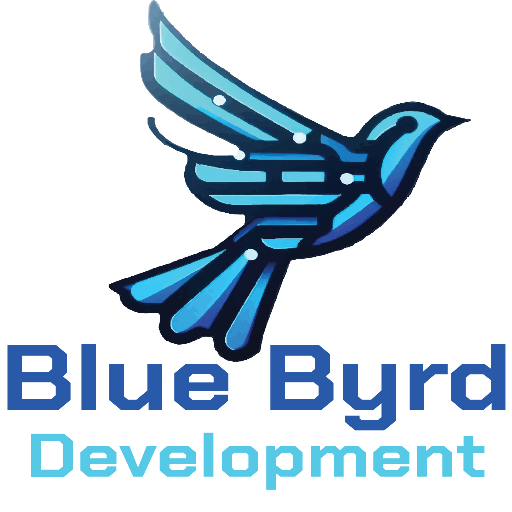

#  

# Blue Byrd Development

**A modern portfolio + business landing page for a freelance web development studio.**

Blue Byrd Development was created to establish a clean, interactive online presence for showcasing services, featured projects, and collecting client inquiries through a custom contact form. The project includes a full frontend, backend, and admin dashboard for managing incoming requests.

---

## ✨ Features

- 🔥 Fast, lightweight frontend powered by Vite + React
- 🎨 Responsive Tailwind CSS styling with dark/light mode
- ⚙️ Animated UI interactions via Framer Motion
- 📬 Fully functional contact form with email sending and database storage
- 🧠 Custom admin dashboard to manage submissions
  - Filter, search, and export messages
  - Batch delete and recycle bin
  - Sort by project type and status

---

## 🛠️ Tech Stack

**Frontend:**
- [React](https://react.dev/)
- [TypeScript](https://www.typescriptlang.org/)
- [Vite](https://vitejs.dev/)
- [Tailwind CSS](https://tailwindcss.com/)
- [Framer Motion](https://www.framer.com/motion/)
- Deployed via Vercel

**Backend:**
- [Node.js](https://nodejs.org/)
- [Express](https://expressjs.com/)
- [CORS](https://expressjs.com/en/resources/middleware/cors.html)
- Nodemailer (for sending emails)
- Deployed via Railway

**Authentication**
-[Firebase Authentication](https://firebase.google.com/products/firestore)

**Database:**
- [Firebase Firestore](https://firebase.google.com/products/firestore)

**Deployment:**
- [Vercel](https://vercel.com/)
- [Railway](https://railway.com/)
- [Namecheap](https://www.namecheap.com/) (Domain DNS)

---

## 👩‍💻 Author

**Karen Byrd**  
[Portfolio](https://karenbyrd.com) | [GitHub](https://github.com/klbyrd) | [LinkedIn](https://www.linkedin.com/in/karenbyrd)

---

## 📝 License

This project is licensed under the [MIT License](https://opensource.org/licenses/MIT).

